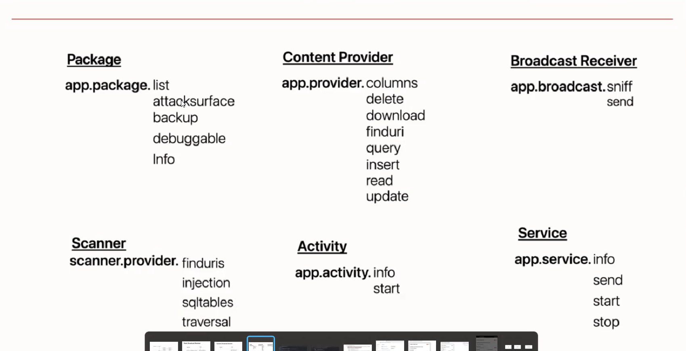

# Drozer

Comprehensive security and attack framework for Android.

## Drozer Setup
I use a Docker setup to avoid dependencies conflicts.

### Steps to Setup Drozer
(This is a tricky setup because Nox doesn't have an IP address):

1. Install Drozer agent on nox 
2. Kill the adb server:
`adb kill-server`
3. Run the nodaemon server:
`adb -a nodaemon server start`
4. Reconnect to the emulator 
`adb connect 127.0.0.1:62001`
5. Expose the Drozer agent port (31415) on (31415) port in Kali machine:

    `adb forward tcp:31415 tcp:31415`

Now, any request to port 31415 on Kali will communicate with the Drozer agent on Nox port 31415.

6. Run the Drozer container from the image and connect to the Kali IP that redirects to the Drozer agent on Nox:

    `docker run -it withsecurelabs/drozer console connect --server YOUR_KALI_IP `

## Drozer Commands Summary
This image summarizes almost all Drozer commands:

## Resources
https://labs.withsecure.com/tools/drozer

https://github.com/WithSecureLabs/drozer/tree/develop/docker