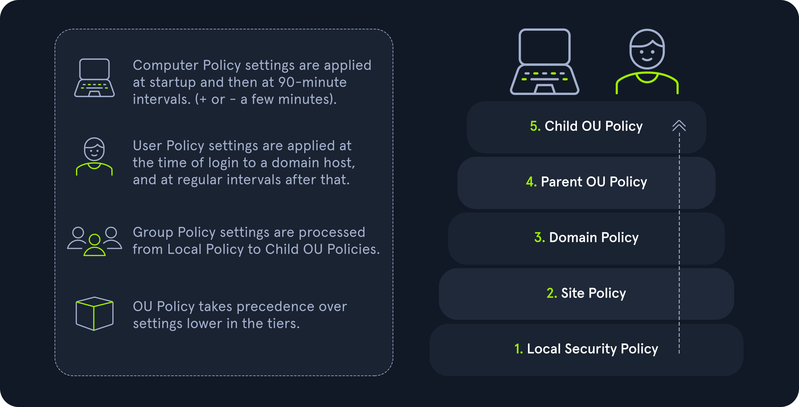

# Active Directory
- [Active Directory Structure](#active-directory-structure)
- [Active Directory Terminology](#active-directoy-terminology)
- [Active Directory Functionality](#active-directory-functionality)
- [Active Direcotoy Protocols](#active-directory-protocols)
- [Users & Groups](#users--groups)
- [Active Directory Rights and Privileges](#active-directory-rights-and-privileges)
- [Security in Active Directory](#security-in-active-directory)
- [Group Policy](#group-policy)
- [AD Administration](#ad-administration) 

------------------------------------------------------------------------------------------------------

- Active Directory (AD) is a directory service for Windows network environments. It is a distributed, hierarchical structure that allows for centralized management of an organization's resources, including users, computers, groups, network devices, file shares, group policies, devices, and trusts.

## Active Directory Structure
- Active Directory is arranged in a hierarchical tree structure, with a forest at the top containing one or more domains, which can themselves have nested subdomains. A forest is the security boundary within which all objects are under administrative control. A forest may contain multiple domains, and a domain may include further child or sub-domains. A domain is a structure within which contained objects (users, computers, and groups) are accessible. It has many built-in Organizational Units (OUs), such as Domain Controllers, Users, Computers, and new OUs can be created as required. OUs may contain objects and sub-OUs, allowing for the assignment of different group policies.

## Active Directoy Terminology

- Object : An object can be defined as ANY resource present within an Active Directory environment such as OUs, printers, users, domain controllers, etc.

- Global Unique Identifier (GUID) : A GUID is a unique 128-bit value assigned when a domain user or group is created. This GUID value is unique across the enterprise, similar to a MAC address. Every single object created by Active Directory is assigned a GUID, not only user and group objects. The GUID is stored in the ObjectGUID attribute.

-  Security Identifier (SID) : A security identifier, or SID is used as a unique identifier for a security principal or security group. Every account, group, or process has its own unique SID, which, in an AD environment, is issued by the domain controller and stored in a secure database. A SID can only be used once. Even if the security principle is deleted, it can never be used again in that environment to identify another user or group.

- sAMAccountName : The sAMAccountName is the user's logon name. Here it would just be bjones. It must be a unique value and 20 or fewer characters.

- userPrincipalName : The userPrincipalName attribute is another way to identify users in AD. This attribute consists of a prefix (the user account name) and a suffix (the domain name) in the format of bjones@inlanefreight.local. This attribute is not mandatory.

- Group Policy Object (GPO) : Group Policy Objects (GPOs) are virtual collections of policy settings. Each GPO has a unique GUID. A GPO can contain local file system settings or Active Directory settings. GPO settings can be applied to both user and computer objects. They can be applied to all users and computers within the domain or defined more granularly at the OU level.

- Tombstone : A tombstone is a container object in AD that holds deleted AD objects. When an object is deleted from AD, the object remains for a set period of time known as the Tombstone Lifetime, and the isDeleted attribute is set to TRUE. Once an object exceeds the Tombstone Lifetime, it will be entirely removed. 

- SYSVOL : The SYSVOL folder, or share, stores copies of public files in the domain such as system policies, Group Policy settings, logon/logoff scripts, and often contains other types of scripts that are executed to perform various tasks in the AD environment. 

- AdminSDHolder : The AdminSDHolder object is used to manage ACLs for members of built-in groups in AD marked as privileged. It acts as a container that holds the Security Descriptor applied to members of protected groups. The SDProp (SD Propagator) process runs on a schedule on the PDC Emulator Domain Controller. When this process runs, it checks members of protected groups to ensure that the correct ACL is applied to them. It runs every hour by default. For example, suppose an attacker is able to create a malicious ACL entry to grant a user certain rights over a member of the Domain Admins group. In that case, unless they modify other settings in AD, these rights will be removed (and they will lose any persistence they were hoping to achieve) when the SDProp process runs on the set interval.

- dsHeuristics : The dsHeuristics attribute is a string value set on the Directory Service object used to define multiple forest-wide configuration settings. One of these settings is to exclude built-in groups from the Protected Groups list. Groups in this list are protected from modification via the AdminSDHolder object. If a group is excluded via the dsHeuristics attribute, then any changes that affect it will not be reverted when the SDProp process runs.

- adminCount : The adminCount attribute determines whether or not the SDProp process protects a user. If the value is set to 0 or not specified, the user is not protected. If the attribute value is set to value, the user is protected. 

- NTDS.DIT : The NTDS.DIT file can be considered the heart of Active Directory. It is stored on a Domain Controller at C:\Windows\NTDS\ and is a database that stores AD data such as information about user and group objects, group membership, and, most important to attackers and penetration testers, the password hashes for all users in the domain.

- MSBROWSE : MSBROWSE is a Microsoft networking protocol that was used in early versions of Windows-based local area networks (LANs) to provide browsing services. It was used to maintain a list of resources, such as shared printers and files, that were available on the network, and to allow users to easily browse and access these resources. Today, MSBROWSE is largely obsolete and is no longer in widespread use. Modern Windows-based LANs use the Server Message Block (SMB) protocol for file and printer sharing, and the Common Internet File System (CIFS) protocol for browsing services.

- Contacts : A contact object is usually used to represent an external user and contains informational attributes such as first name, last name, email address, telephone number, etc. They are leaf objects and are NOT security principals (securable objects), so they don't have a SID, only a GUID. An example would be a contact card for a third-party vendor or a customer.

- **Active Directory Object** : Foreign Security Principals > A foreign security principal (FSP) is an object created in AD to represent a security principal that belongs to a trusted external forest. They are created when an object such as a user, group, or computer from an external (outside of the current) forest is added to a group in the current domain. They are created automatically after adding a security principal to a group. Every foreign security principal is a placeholder object that holds the SID of the foreign object (an object that belongs to another forest.) Windows uses this SID to resolve the object's name via the trust relationship. FSPs are created in a specific container named ForeignSecurityPrincipals with a distinguished name like cn=ForeignSecurityPrincipals,dc=inlanefreight,dc=local.

## Active Directory Functionality

|    Roles    | Description|
|:-------------|:-----------|
|Schema Master|This role manages the read/write copy of the AD schema, which defines all attributes that can apply to an object in AD.|
|Domain Naming Master|Manages domain names and ensures that two domains of the same name are not created in the same forest.|
|Relative ID (RID) Master|The RID Master assigns blocks of RIDs to other DCs within the domain that can be used for new objects. The RID Master helps ensure that multiple objects are not assigned the same SID. Domain object SIDs are the domain SID combined with the RID number assigned to the object to make the unique SID.|
|PDC Emulator|The host with this role would be the authoritative DC in the domain and respond to authentication requests, password changes, and manage Group Policy Objects (GPOs). The PDC Emulator also maintains time within the domain.|
|Infrastructure Master|This role translates GUIDs, SIDs, and DNs between domains. This role is used in organizations with multiple domains in a single forest. The Infrastructure Master helps them to communicate. If this role is not functioning properly, Access Control Lists (ACLs) will show SIDs instead of fully resolved names.|

- Trusts: A trust is used to establish forest-forest or domain-domain authentication, allowing users to access resources in (or administer) another domain outside of the domain their account resides in. A trust creates a link between the authentication systems of two domains.

- There are several trust types.

| Trust Type |Description|
|:------------:|:------------|
|Parent-child|Domains within the same forest. The child domain has a two-way transitive trust with the parent domain.|
|Cross-link|A trust between child domains to speed up authentication.|
|External|A non-transitive trust between two separate domains in separate forests which are not already joined by a forest trust. This type of trust utilizes SID filtering.|
|Tree-root|a two-way transitive trust between a forest root domain and a new tree root domain. They are created by design when you set up a new tree root domain within a forest.|
|Forest|a transitive trust between two forest root domains.|

- Trusts can be transitive or non-transitive.

    - A transitive trust means that trust is extended to objects that the child domain trusts.

    - In a non-transitive trust, only the child domain itself is trusted.

## Active Directory Protocols
### Kerberos
- Kerberos has been the default authentication protocol for domain accounts since Windows 2000. 
- Kerberos is a stateless authentication protocol based on tickets instead of transmitting user passwords over the network. 
- Domain Controllers have a Kerberos Key Distribution Center (KDC) that issues tickets. 
- The Kerberos protocol uses port 88 (both TCP and UDP).
### DNS
- Active Directory Domain Services (AD DS) uses DNS to allow clients (workstations, servers, and other systems that communicate with the domain) to locate Domain Controllers and for Domain Controllers that host the directory service to communicate amongst themselves. 
- DNS uses TCP and UDP port 53. UDP port 53 is the default, but it falls back to TCP when no longer able to communicate and DNS messages are larger than 512 bytes.

### LDAP 
- LDAP uses port 389, and LDAP over SSL (LDAPS) communicates over port 636.
- An LDAP session begins by first connecting to an LDAP server, also known as a Directory System Agent. The Domain Controller in AD actively listens for LDAP requests, such as security authentication requests.

### NTLM Authentication
- LAN Manager (LM or LANMAN) hashes are the oldest password storage mechanism used by the Windows operating system.
> [!NOTE]
>
> Windows operating systems prior to Windows Vista and Windows Server 2008 (Windows NT4, Windows 2000, Windows 2003, Windows XP) stored both the LM hash and the NTLM hash of a user's password by default. 
>
> Neither LANMAN nor NTLM uses a salt.
- The NTLM protocol performs a challenge/response between a server and client using the NT hash. NTLMv1 uses both the NT and the LM hash.
- NTLMv1 was the building block for modern NTLM authentication.
- Domain Cached Credentials (MSCache2) : solve the potential issue of a domain-joined host being unable to communicate with a domain controller (i.e., due to a network outage or other technical issue). Hosts save the last ten hashes for any domain users that successfully log into the machine in the HKEY_LOCAL_MACHINE\SECURITY\Cache registry key.

## Users & Groups

### Local Accounts

- Administrator: this account has the SID S-1-5-domain-500 and is the first account created with a new Windows installation.Windows 10 and Server 2016 hosts disable the built-in administrator account by default and create another local account in the local administrator's group during setup.

- Guest: this account is disabled by default. The purpose of this account is to allow users without an account on the computer to log in temporarily with limited access rights. 

- SYSTEM: The SYSTEM (or NT AUTHORITY\SYSTEM) account on a Windows host is the default account installed and used by the operating system to perform many of its internal functions.

- Network Service: This is a predefined local account used by the Service Control Manager (SCM) for running Windows services. When a service runs in the context of this particular account, it will present credentials to remote services.

- Local Service: This is another predefined local account used by the Service Control Manager (SCM) for running Windows services. It is configured with minimal privileges on the computer and presents anonymous credentials to the network.

### Domain Users

- Domain users differ from local users in that they are granted rights from the domain
    - One account to keep in mind is the KRBTGT account, however. This is a type of local account built into the AD infrastructure. This account acts as a service account for the Key Distribution service providing authentication and access for domain resources. 

### User Naming Attributes

- UserPrincipalName (UPN): This is the primary logon name for the user. By convention, the UPN uses the email address of the user.

- ObjectGUID: This is a unique identifier of the user. In AD, the ObjectGUID attribute name never changes and remains unique even if the user is removed

- SAMAccountName: This is a logon name that supports the previous version of Windows clients and servers.

- objectSID: The user's Security Identifier (SID). This attribute identifies a user and its group memberships during security interactions with the server.

- sIDHistory: This contains previous SIDs for the user object if moved from another domain and is typically seen in migration scenarios from domain to domain. After a migration occurs, the last SID will be added to the sIDHistory property, and the new SID will become its objectSID.

### Groups 
#### Types of Groups 
- There are two main types: security and distribution groups.
    - The Security groups type is primarily for ease of assigning permissions and rights to a collection of users instead of one at a time. They simplify management and reduce overhead when assigning permissions and rights for a given resource. 
    - The Distribution groups type is used by email applications such as Microsoft Exchange to distribute messages to group members. This type of group cannot be used to assign permissions to resources in a domain environment.
#### Group Scopes
- There are three different group scopes that can be assigned when creating a new group.

1. Domain Local Group
2. Global Group
3. Universal Group

- **Domain Local Group**: Domain local groups can only be used to manage permissions to domain resources in the domain where it was created. Local groups cannot be used in other domains but CAN contain users from OTHER domains. Local groups can be nested into (contained within) other local groups but NOT within global groups.
- **Global Group**: Global groups can be used to grant access to resources in another domain. A global group can only contain accounts from the domain where it was created. Global groups can be added to both other global groups and local groups.
- **Universal Group**: The universal group scope can be used to manage resources distributed across multiple domains and can be given permissions to any object within the same forest. They are available to all domains within an organization and can contain users from any domain.

>[!WARNING]
>Group scopes can be changed, but there are a few caveats:
>
>   - A Global Group can only be converted to a Universal Group if it is NOT part of another Global Group.
>
>   - A Domain Local Group can only be converted to a Universal Group if the Domain Local Group does NOT contain any other Domain Local Groups as members.
>
>   - A Universal Group can be converted to a Domain Local Group without any restrictions.
>
>   - A Universal Group can only be converted to a Global Group if it does NOT contain any other Universal Groups as members.

#### **Important Group Attributes**
- Like users, groups have many attributes. Some of the most important group attributes include:

    - cn: The cn or Common-Name is the name of the group in Active Directory Domain Services.

    - member: Which user, group, and contact objects are members of the group.

    - groupType: An integer that specifies the group type and scope.

    - memberOf: A listing of any groups that contain the group as a member (nested group membership).

    - objectSid: This is the security identifier or SID of the group, which is the unique value used to identify the group as a security principal.

## Active Directory Rights and Privileges
- Rights are typically assigned to users or groups and deal with permissions to access an object such as a file, while privileges grant a user permission to perform an action such as run a program, shut down a system, reset passwords, etc.
-  `whoami /priv` : will give us a listing of all user rights assigned to the current user. 

## Security in Active Directory
### General Active Directory Hardening Measures
- The Microsoft Local Administrator Password Solution (LAPS) is used to randomize and rotate local administrator passwords on Windows hosts and prevent lateral movement.

- LAPS: Accounts can be set up to have their password rotated on a fixed interval (i.e., 12 hours, 24 hours, etc.).
- Audit Policy Settings (Logging and Monitoring): Every organization needs to have logging and monitoring setup to detect and react to unexpected changes or activities that may indicate an attack.
- Group Policy Security Settings: 
    - Account Policies - Manage how user accounts interact with the domain.
    - Local Policies - These apply to a specific computer and include the security event audit policy, user rights assignments (user privileges on a host).
    - Software Restriction Policies - Settings to control what software can be run on a host.
    - Application Control Policies - Settings to control which applications can be run by certain users/groups. This may include blocking certain users from running all executables, Windows Installer files, scripts, etc.
    - Advanced Audit Policy Configuration - A variety of settings that can be adjusted to audit activities such as file access or modification, account logon/logoff, policy changes, privilege usage, and more.
- Update Management (SCCM/WSUS) - The Windows Server Update Service (WSUS) can be installed as a role on a Windows Server and can be used to minimize the manual task of patching Windows systems. System Center Configuration Manager (SCCM) is a paid solution that relies on the WSUS Windows Server role being installed and offers more features than WSUS on its own.
- Group Managed Service Accounts (gMSA) - A gMSA is an account managed by the domain that offers a higher level of security than other types of service accounts for use with non-interactive applications, services, processes, and tasks that are run automatically
- Security Groups 
- Account Separation - Administrators must have two separate accounts. One for their day-to-day work and a second for any administrative tasks they must perform
- Password Complexity Policies + Passphrases + 2FA - Ideally, an organization should be using passphrases or large randomly generated passwords using an enterprise password manager. 
- Limiting Domain Admin Account Usage - All-powerful Domain Admin accounts should only be used to log in to Domain Controllers, not personal workstations, jump hosts, web servers, etc. 
- Periodically Auditing and Removing Stale Users and Objects - It is important for an organization to periodically audit Active Directory and remove or disable any unused accounts.
- Auditing Permissions and Access - Organizations should also periodically perform access control audits to ensure that users only have the level of access required for their day-to-day work.
- Audit Policies & Logging - Visibility into the domain is a must. An organization can achieve this through robust logging and then using rules to detect anomalous activity.
- Using Restricted Groups - Restricted Groups allow for administrators to configure group membership via Group Policy.
- Limiting Server Roles - It is important not to install additional roles on sensitive hosts, such as installing the Internet Information Server (IIS) role on a Domain Controller.
- Limiting Local Admin and RDP Rights - Organizations should tightly control which users have local admin rights on which computers

## Group Policy
- Group Policy is a Windows feature that provides administrators with a wide array of advanced settings that can apply to both user and computer accounts in a Windows environment.
- Group Policy Objects (GPOs):
    - A Group Policy Object (GPO) is a virtual collection of policy settings that can be applied to user(s) or computer(s).
    - GPOs include policies such as screen lock timeout, disabling USB ports, enforcing a custom domain password policy and much more.
    - Every GPO has a unique name and is assigned a unique identifier (a GUID).

## AD Administration

- To ADD a user into Active Directory, we First need to load the module with the "Import-Module -Name ActiveDirectory" cmdlet. The AD module can be installed via the RSAT feature pack
- PowerShell
    - Add a User `New-ADUser -Name "Artemis Callisto" -GivenName "Artemis" -Surname "Callisto" -DisplayName "Artemis Callisto" -EmailAddress "a.callisto@inlanefreight.local" -UserPrincipalName "a.callisto@inlanefreight.local" -AccountPassword (ConvertTo-SecureString -AsPlainText (Read-Host "Enter a secure password") -Force) -Enabled $true -OtherAttributes @{'title'="Analyst"} -ChangePasswordAtLogon $true`
    - Validate User `Get-ADUser  Ahmed`
    - Remove a User `Remove-ADUser -Identity pvalencia`
    - Unlock an Account `Unlock-ADAccount -Identity amasters`
    - Reset User Password `Set-ADAccountPassword -Identity 'amasters' -Reset -NewPassword (ConvertTo-SecureString -AsPlainText "NewP@ssw0rdReset!" -Force)`
    - Force Password Change `Set-ADUser -Identity amasters -ChangePasswordAtLogon $true`
