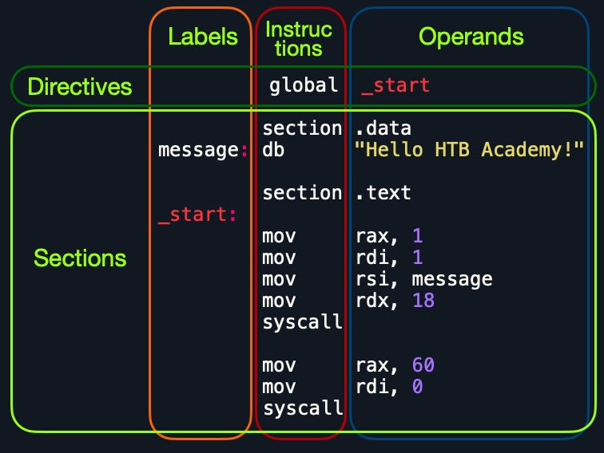

# Assembly x86
- [Assembly and Machine Code](#assembly-and-machine-code)
- [IA-32 Processor Architecture](#ia-32-processor-architecture)
- [History of IA-32 Architecture](#history-of-ia-32-architecture)
- [IA-32e x86 Memory Addresses](#ia-32e-x86-memory-addresses)
  - [Address Endianness](#address-endianness)
- [Assembling & Debugging](#assembling--debugging)
  - [Assembly File Structure](#assembly-file-structure)
  - [Assembling & Disassembling](#assembling--disassembling)
  - [GNU Debugger (GDB)](#gnu-debugger-gdb)
    - [Break](#break)
    - [Examine](#examine)
    - [Step](#step)
    - [Modify](#modify)
- [Basic Instructions](#basic-instructions)
  - [Data Movement](#data-movement)
  - [Arithmetic Instructions](#arithmetic-instructions)
    - [Unary Instructions](#unary-instructions)
    - [Binary Instructions](#binary-instructions)
    - [Bitwise Instructions](#bitwise-instructions)
- [Control Instructions](#control-instructions)
  - [Loops](#loops)
  - [Unconditional Branching](#unconditional-branching)
  - [Conditional Branching](#conditional-branching)
- [Functions](#functions)
  - [Using the Stack](#using-the-stack)
  - [Syscalls](#syscalls)
  


## Assembly and Machine Code

- When we compile a C program, the C compiler produces an assembly file. This assembly file is then converted into machine code with file extensions such as `.obj` or `.o`. Finally, during the linking phase, these object files are linked together to produce an executable (`.exe`) file, which the processor can run.


- Levels of Input-Output
  - Level 3: High-level language function
  - Level 2: Operating System
  - Level 1: BIOS
- Assembly language programs can perform input-output at each of the above levels, plus **Level 0**: Hardware.

- Assembling (running MASM) does not actually create an executable program; additional steps are needed for linking.


- Assemble-Link Execute Cycle
  - If the source code is modified, Steps 2 through 4 must be repeated.
  


- Instruction Set Architecture (ISA) mainly consists of the following components:

  - Instructions
  - Registers
  - Memory Addresses
  - Data Types

- There are two main Instruction Set Architectures that are widely used:

  - Complex Instruction Set Computer (CISC) - Used in Intel and AMD processors in most computers and servers.
  - Reduced Instruction Set Computer (RISC) - Used in ARM and Apple processors, in most smartphones, and some modern laptops.

- **CISC vs. RISC**
- The following table summarizes the main differences between CISC and RISC:

|Area  |	CISC	|   RISC |
|:----:|:-------:|:-------|
|Complexity|	Favors complex instructions|	Favors simple instructions|
|Length of instructions|	Longer instructions - Variable length 'multiples of 8-bits'|	Shorter instructions - Fixed length '32-bit/64-bit'|
|Total instructions per program	| Fewer total instructions - Shorter code	| More total instructions - Longer code|
|Optimization | 	Relies on hardware optimization (in CPU)	| Relies on software optimization (in Assembly)|
|Instruction Execution Time	| Variable - Multiple clock cycles	| Fixed - One clock cycle | 
|Instructions supported by CPU	| Many instructions (~1500)	| Fewer instructions (~200)|
|Power Consumption| 	High|	Very low|
|Examples|	Intel, AMD |	ARM, Apple|


## IA-32 Processor Architecture

### Basic Program Execution Registers

- Registers are high-speed storage locations directly inside the CPU.

### Types of Registers

1. **General Purpose Registers**
2. **Segment Registers**
3. **Processor Status Flags Register** (one register)
4. **Instruction Pointer**

1. General Purpose Registers

General-purpose registers are primarily used for arithmetic and data movement operations. The following image applies to EAX, EBX, ECX, and EDX:


### Index & Base Registers

The remaining general-purpose registers have only a 16-bit name for their lower half:


### Intended Register Use

#### General-purpose Registers

| Register | Use                  |
|----------|----------------------|
| EAX      | Accumulator          |
| ECX      | Loop Counter         |
| ESP      | Stack Pointer        |
| ESI, EDI | Index Registers      |
| EBP      | Extended (Stack) Frame (Base) Pointer |

2. Segment Registers

| Register | Use            |
|----------|----------------|
| CS       | Code Segment   |
| DS       | Data Segment   |
| SS       | Stack Segment  |

3. Processor Status Flags Register
- **EFlags**
  - Status and control flags.
  - Each flag is a single binary bit.

- Status Flags

  - **Carry**: Unsigned arithmetic out of range.
  - **Overflow**: Signed arithmetic out of range.
  - **Sign**: Result is negative.
  - **Zero**: Result is zero.


4. **EIP (Instruction Pointer)**
  - The address of the next instruction to be executed.

## History of IA-32 Architecture

1. **Intel 8086** - 16-bit Registers - RAM up to 1 MB
2. **Intel 80386** - 32-bit Registers - RAM up to 4 GB - Paging (Virtual Memory)
3. **Intel 80486** - Instruction Pipelining
4. **Pentium (P5)** - Superscalar (Multiple ALU)
5. **Intel 64 Mode** - 64-bit Linear Address Space
   - IA-32e Mode (2 Sub-Modes)
     - Compatibility mode for legacy 16 and 32-bit applications.
     - 64-bit mode uses 64-bit addresses and operands.

## IA-32e x86 Memory Addresses
- x86 64-bit processors have 64-bit wide addresses that range from 0x0 to 0xffffffffffffffff

|Addressing Mode|	Description	| Example |
|:--------------|:------------|:---------|
|Immediate|	The value is given within the instruction	|add 2|
|Register|	The register name that holds the value is given in the instruction	|add rax |
|Direct|	The direct full address is given in the instruction	| call 0xffffffffaa8a25ff|
|Indirect|	A reference pointer is given in the instruction	| call 0x44d000 or call [rax]|
|Stack|	Address is on top of the stack	|add rsp|

### Address Endianness 
- An address endianness is the order of its bytes in which they are stored or retrieved from memory. 
- There are two types of endianness: Little-Endian and Big-Endian
- With Little-Endian processors, the little-end byte of the address is filled/retrieved first right-to-left, while with Big-Endian processors, the big-end byte is filled/retrieved first left-to-right.


### Basic DataTypes
- BYTE, SBYTE: 8-bit Unsigned & Signed integers
- WORD, SWORD: 16-bit Unsigned & Signed integers
- DWORD, SWORD: 32-bit Unsigned & Signed integers
- QWORD: 64-bit integer | Not signed / unsigned 
- TBYTE: 80-bit (Ten byte) integer

>[!NOTE]
> Whenever we use a variable with a certain data type or use a data type with an instruction, both operands should be of the same size.


## Assembling & Debugging

### Assembly File Structure


|Section  |	  Description  |
|:--------|:---------------|
|global _start|	This is a directive that directs the code to start executing at the _start label defined below.|
|section .data|	This is the data section, which should contain all of the variables.|
|section .text|	This is the text section containing all of the code to be executed.|

- `db` for a list of bytes, `dw` for a list of words, `dd` for a list of digits.
-  Use the `equ` instruction with the `$` token to evaluate an expression: 
```
section .data
    message db "Hello World!", 0x0a
    length  equ $-message
```

> [!NOTE]
> The text segment within the memory is read-only, so we cannot write any variables within it. The data section, on the other hand, is read/write, which is why we write our variables to it.

> [!TIP]
> We can add comments to our assembly code with a semi-colon ;

### Assembling & Disassembling
#### Assembling

> [!NOTE] 
> Assembly files usually use the .s or the .asm extensions.

- Assemble the files `nasm -f elf64 helloWorld.s`

> [!NOTE]
> The `-f elf64` flag is used to note that we want to assemble a 64-bit assembly code. If we wanted to assemble a 32-bit code, we would use `-f elf`.

- ELF stands for Executable and Linkable Format.
- After assembling, we should link our file using `ld`: `ld -o helloWorld helloWorld.o`

> [!NOTE]
> If we were to assemble a 32-bit binary, we need to add the `-m elf_i386` flag.

- Simple bash script to assemble, link and run the file:
```
#!/bin/bash

fileName="${1%%.*}" # remove .s extension

nasm -f elf64 ${fileName}".s"
ld ${fileName}".o" -o ${fileName}
[ "$2" == "-g" ] && gdb -q ${fileName} || ./${fileName}
```
#### Disassembling
- To disassemble a file, we will use the objdump tool. We can disassemble a binary using the `-D` flag.

> [!NOTE]
> We will also use the flag -M intel, so that objdump would write the instructions in the Intel syntax.

- If we wanted to only show the assembly code, without machine code or addresses, we could add the `--no-show-raw-insn` `--no-addresses` flags, as follows: `objdump -M intel --no-show-raw-insn --no-addresses -d helloWorld`

- The `-d` flag will only disassemble the .text section of our code. To dump any strings, we can use the `-s` flag, and add `-j .data` to only examine the .data section: `objdump -sj .data helloWorld`

### GNU Debugger (GDB) 
- GEF is a free and open-source GDB plugin that is built precisely for reverse engineering and binary exploitation.
- To add GEF to GDB, we can use the following commands:
```
wget -O ~/.gdbinit-gef.py -q https://gef.blah.cat/py
echo source ~/.gdbinit-gef.py >> ~/.gdbinit
```

- Using the previous script, we add `-g` to run the code with gdb
- Use the `info` command to view general information about the program, like its functions or variables.
- Use the `disassemble` or `disas` command to disassemble function 

### Debugging with GDB
- Debugging consists mainly of four steps:

|Step	  |  Description  |
|:------|:------------|
|Break	|  Setting breakpoints at various points of interest|
|Examine|	Running the program and examining the state of the program at these points|
|Step|	Moving through the program to examine how it acts with each instruction and with user input|
|Modify|	Modify values in specific registers or addresses at specific breakpoints, to study how it would affect the execution|

#### Break

- We can use the `break` or `b` command along with the address or function name we want to break at.
- We can set a breakpoint at a certain address, like _start+10, we can either `b *_start+10` or `b *0x40100a`
- The * tells GDB to break at the instruction stored in 0x40100a.
- If we want to see what breakpoints we have at any point of the execution, we can use the` info breakpoint` command. We can also `disable, enable, or delete` any breakpoint

#### Examine

- We can use the `x` command in the format of `x/FMT ADDRESS`
- Use the `registers`command to print out the current value of all registers:
-  The examine format FMT can have three parts:

|Argument	| Description	 |  Example   |
|:--------|:-------------|:-----------|
|Count|	The number of times we want to repeat the examine|	2, 3, 10|
|Format|	The format we want the result to be represented in|	x(hex), s(string), i(instruction)|
|Size	|The size of memory we want to examine	|b(byte), h(halfword), w(word), g(giant, 8 bytes)|

> [!NOTE]
> If we don't specify the Size or Format, it will default to the last one we used.


#### Step
- To move through the program, there are three different commands we can use: `stepi` , `step` and `si`.
- We can repeat the `si` command by adding a number after it, e.g. `si 3`

> [!NOTE]
> There's also the next or `n` command, which will also continue until the next line, but will skip any functions called in the same line of code, instead of breaking at them like step. There's also the `nexti` or `ni`, which is similar to `si`, but skips functions calls.

#### Modify

- To modify values in GDB, we can use the `set` command.
- We utilize the `patch` command in GEF to make this step much easier.We have to provide the type/size of the new value, the location to be stored, and the value we want to use, e.g. `patch string 0x402000 "Patched!\\x0a"`

> [!NOTE]
> `\x0a` for adding a new line after our string.


## Basic Instructions
### Data Movement

- The main Data Movement instructions are:

|Instruction|	Description	|Example|
|:---------|:------------|:-------|
|mov|	Move data or load immediate data|	mov rax, 1 -> rax = 1|
|lea|	Load an address pointing to the value	|lea rax, [rsp+5] -> rax = rsp+5|
|xchg|	Swap data between two registers or addresses	|xchg rax, rbx -> rax = rbx, rbx = rax|


- When we make `mov rax, rsp` , we won't be moving the value of `rsp` to `rax`, but we will be moving the pointer address of `rsp`.
- To move the actual value, we will have to use square brackets `[]` like `mov rax, [rsp]` 
- Both `mov rax, rsp` and `lea rax, [rsp]` will do the same thing of storing the pointer to message at `rax`.

> [!NOTE]
> If we wanted to load a pointer with an offset. we should use lea (i.e., `[rsp+10]`).
> If we use `mov rax, [rsp+10]`, it will actually move the value at `[rsp+10]` to `rax`. We cannot move a pointer with an offset using `mov`.

### Arithmetic Instructions
- We will split arithmetic instructions into two types: instructions that take only one operand (Unary), instructions that take two operands (Binary).

#### Unary Instructions
- The following are the main Unary Arithmetic Instructions (we will assume that rax starts as 1 for each instruction):

|Instruction|	Description	|Example|
|----|--------------------|---------|
|inc|	Increment by 1|	inc rax -> rax++ or rax += 1 -> rax = 2|
|dec|	Decrement by 1|	dec rax -> rax-- or rax -= 1 -> rax = 0|


#### Binary Instructions

|Instruction|	Description	|Example|
|-----------|-------------|--------|
|add|	Add both operands	|add rax, rbx -> rax = 1 + 1 -> 2|
|sub	|Subtract Source from Destination (i.e rax = rax - rbx)|	sub rax, rbx -> rax = 1 - 1 -> 0|
|imul|	Multiply both operands	|imul rax, rbx -> rax = 1 * 1 -> 1|


#### Bitwise Instructions


|Instruction|	Description|	Example|
|-----------|------------|---------|
|not|	Bitwise NOT (invert all bits, 0->1 and 1->0)	|not rax -> NOT 00000001 -> 11111110|
|and|	Bitwise AND (if both bits are 1 -> 1, if bits are different -> 0)|	and rax, rbx -> 00000001 AND 00000010 -> 00000000|
|or|	Bitwise OR (if either bit is 1 -> 1, if both are 0 -> 0)|	or rax, rbx -> 00000001 OR 00000010 -> 00000011|
|xor|	Bitwise XOR (if bits are the same -> 0, if bits are different -> 1)|	xor rax, rbx -> 00000001 XOR 00000010 -> 00000011|

- `xor`ing our registers with themselves turned each of them to 0's

## Control Instructions
### Loops

- Types of Control Instructions include:

  - Loops	
  - Branching	
  - Function Calls

#### **Loop Structure**
  -  A loop in assembly is a set of instructions that repeat for `rcx` times.
  - Example:
  ```
  exampleLoop:
    instruction 1
    instruction 2
    instruction 3
    instruction 4
    instruction 5
    loop exampleLoop
  ```

> [!NOTE]
> Before we enter any loop, we should `mov` the number of loop iterations we want to the `rcx` register.

### Unconditional Branching

|Instruction|	Description	|Example|
|----------|--------------|-------|
|jmp|	Jumps to specified label, address, or location|	jmp loop|


### Conditional Branching

- The following are some of the main condition codes:

|Instruction|	Condition|	Description|
|-----------|----------|-------------|
|jz|	D = 0|	Destination equal to Zero|
|jnz|	D != 0|	Destination Not equal to Zero|
|js	|D < 0|	Destination is Negative|
|jns|	D >= 0|	Destination is Not Negative (i.e. 0 or positive)|
|jg|	D > S|	Destination Greater than Source|
|jge|	D >= S|	Destination Greater than or Equal Source|
|jl|	D < S|	Destination Less than Source|
|jle|	D <= S|	Destination Less than or Equal Source|


- **RFLAGS Register**
  - The RFLAGS register consists of 64-bits like any other register. However, this register does not hold values but holds flag bits instead. Each bit 'or set of bits' turns to 1 or 0 depending on the value of the last instruction.
  - The flags we would mostly be interested in are:

    - The Carry Flag CF: Indicates whether we have a float.
    - The Parity Flag PF: Indicates whether a number is odd or even.
    - The Zero Flag ZF: Indicates whether a number is zero.
    - The Sign Flag SF: Indicates whether a register is negative.

- **CMP**

|Instruction|	Description|	Example|
|-----------|------------|----------|
|cmp|	Sets RFLAGS by subtracting second operand from first operand (i.e. first - second)	|cmp rax, rbx -> rax - rbx|

- The main advantage of 'cmp' is that it does not affect the operands.

> [!NOTE]
> In a `cmp` instruction, the first operand (i.e. the Destination) must be a register, while the other can be a register, a variable, or an immediate value.


## Functions
### Using the Stack
- The top of the stack is referred to by the Top Stack Pointer `rsp`, while the bottom is referred to by the Base Stack Pointer `rbp`.

|Instruction|	Description|	Example|
|-----------|------------|---------|
|push	|Copies the specified register/address to the top of the stack	|push rax|
|pop	|Moves the item at the top of the stack to the specified register/address	|pop rax|

- We use them when we get into function calls.


### Syscalls

