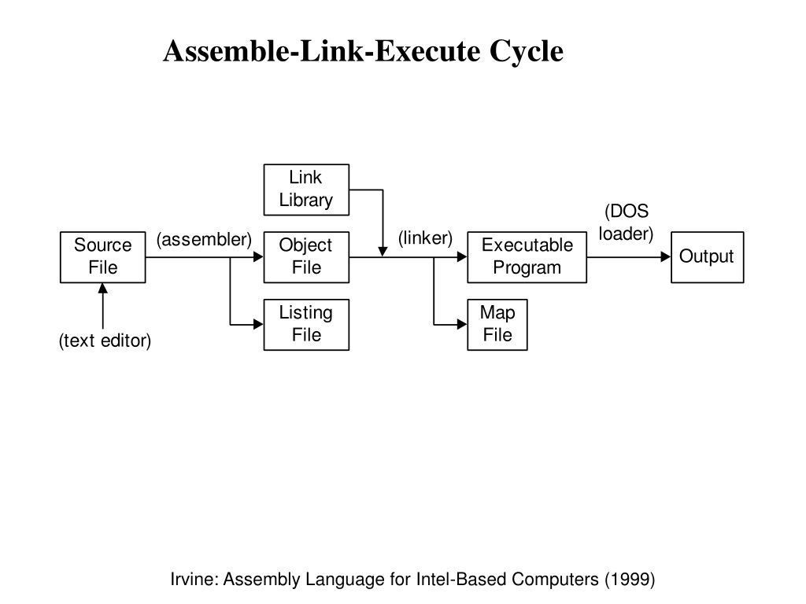

# Assembly x86

## Assembly and Machine Code

- When we compile a C program, the C compiler produces an assembly file. This assembly file is then converted into machine code with file extensions such as `.obj` or `.o`. Finally, during the linking phase, these object files are linked together to produce an executable (`.exe`) file, which the processor can run.
- Note: Assembling (running MASM) does not actually create an executable program; additional steps are needed for linking.

## IA-32 Processor Architecture

### Basic Program Execution Registers

- Registers are high-speed storage locations directly inside the CPU.

### Types of Registers

- **General Purpose Registers**
- **Segment Registers**
- **Processor Status Flags Register** (one register)
- **Instruction Pointer**

### General Purpose Registers

General-purpose registers are primarily used for arithmetic and data movement operations. The following image applies to EAX, EBX, ECX, and EDX:


### Index & Base Registers

The remaining general-purpose registers have only a 16-bit name for their lower half:


### Intended Register Use

#### General-purpose Registers

| Register | Use                  |
|----------|----------------------|
| EAX      | Accumulator          |
| ECX      | Loop Counter         |
| ESP      | Stack Pointer        |
| ESI, EDI | Index Registers      |
| EBP      | Extended (Stack) Frame (Base) Pointer |

#### Segment Registers

| Register | Use            |
|----------|----------------|
| CS       | Code Segment   |
| DS       | Data Segment   |
| SS       | Stack Segment  |

### Specialized Registers

- **EIP (Instruction Pointer)**
  - The address of the next instruction to be executed.
- **EFlags**
  - Status and control flags.
  - Each flag is a single binary bit.

### Status Flags

- **Carry**: Unsigned arithmetic out of range.
- **Overflow**: Signed arithmetic out of range.
- **Sign**: Result is negative.
- **Zero**: Result is zero.

## History of IA-32 Architecture

1. **Intel 8086** - 16-bit Registers - RAM up to 1 MB
2. **Intel 80386** - 32-bit Registers - RAM up to 4 GB - Paging (Virtual Memory)
3. **Intel 80486** - Instruction Pipelining
4. **Pentium (P5)** - Superscalar (Multiple ALU)
5. **Intel 64 Mode** - 64-bit Linear Address Space
   - IA-32e Mode (2 Sub-Modes)
     - Compatibility mode for legacy 16 and 32-bit applications.
     - 64-bit mode uses 64-bit addresses and operands.

## IA-32e x86 Memory Management

### Protected Mode

- Native mode for Windows and Linux.
- Processor prevents programs from referencing memory outside their assigned segments.

### Real-Address Mode

- Native mode for MS-DOS.
- Direct access to system memory and hardware devices, which can cause the OS to crash.

### System Management Mode

- Power management
- System security
- Diagnostics

## Addressable Memory

### Protected Mode

- Memory segment up to 4 GB
- 32-bit address

### Real-Address and Virtual-8086 Modes

- 1 MB space
- 20-bit address (segment-offset)

### Protected Mode Memory Models

- Flat segment model
- Multi-segment model
- Paging

## Levels of Input-Output

- **Level 3**: High-level language function
- **Level 2**: Operating System
- **Level 1**: BIOS
- Assembly language programs can perform input-output at each of the above levels, plus **Level 0**: Hardware


### Assemble-Link Execute Cycle

- If the source code is modified, Steps 2 through 4 must be repeated.



## Integers Constants

**[{+|-} digits (radix)]**

- Sign is optional
- Common radix characters:
  - h: hexadecimal
  - d: decimal
  - b: binary
- Note that hexadecimal can't begin with a letter: `0A5h`
- We can write expressions: `(2*3) + 4/6`

## Characters and Strings

- Enclosed in `''` or `""`
- Embedded quotes are allowed:
  - `'say "Good night," Grace'`

## Identifiers (Variables)

- 1-247 characters, including digits
- Not case sensitive
- First character must be a letter, `$`, `_`, `@`, or `?`

## Directives

- Instructions on how to assemble
- Used to declare code, data areas, and select memory model
- Not case sensitive (e.g., `.data`, `.DATA`)

### Defining Segments

- Data
- Code
- Stack `100h`

## Intel Instructions

### An Instruction Contains:

- Label (optional)
- Mnemonic (required)
- Operands (depend on the instruction)
- Comment (optional) - begins with `;`

Example:

```assembly
loop1: mov eax, 32 ; count of array elements
```

### NOP: No Operation Instruction

- Uses 1 byte of storage.
- Used to align code to even-address boundaries.

### Program Template

```assembly
TITLE ProjectName
.data

.code
main PROC
    ; We can use 'main' as a name for the main function or any other name such as 'abdeen'
    ; Insert executable instructions here
    exit
main ENDP
END main
```

Example:
```assembly
TITLE MyFirstProject
.code 
    main PROC
    mov eax, 10000h
    add eax, 40000h
    sub eax, 20000h
    call DumpRegs ; Print registers
    exit 
    main ENDP
END main
```

### Basic DataTypes
BYTE, SBYTE: 8-bit Unsigned & Signed integers
WORD, SWORD: 16-bit Unsigned & Signed integers
DWORD, SWORD: 32-bit Unsigned & Signed integers
QWORD: 64-bit integer | Not signed / unsigned 
TBYTE: 80-bit (Ten byte) integer

### Define variable
e.g.
value1 BYTE 10
- use the ? symbol for undefined variable
#### Define Byte Array 
List1 BYTE 10,20,30,40


## x86 CPU Stack
- LIFO Structure
- Managed by the CPU, Using two registers
    - SS (Stack segment) - segment being used for stack
    - ESP (Stack pointer) - Pointer / Address / offset of top of stack 
- In Reality, the stack pointer starts at the highest location in the stack segment 
- During Pushing, The stack grows downward (into LOWER addresses/offsets)
- In Pop operation : Adds n to ESP, Where n is either 2 or 4 (depending on size of destination)


